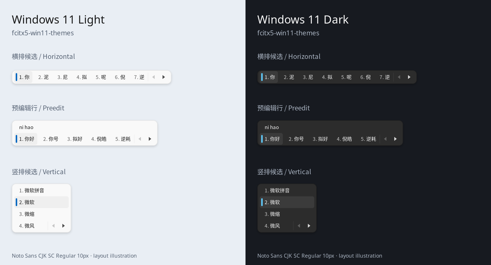
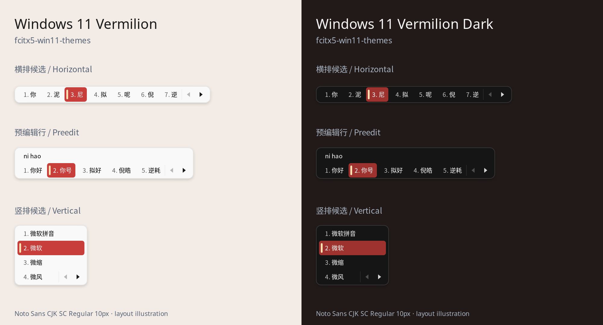

**中文** | [English](./README.en.md)

# fcitx5-win11-themes

基于 [fcitx5-mellow-themes](https://github.com/sanweiya/fcitx5-mellow-themes) 改造的 Fcitx5 经典用户界面主题，尽量还原 Windows 11 微软拼音候选框。

提供 **Windows 11 Light / 浅色**（`win11-light`）和 **Windows 11 Dark / 深色**（`win11-dark`）。使用 8 px 外圆角、细边框、柔和阴影、浅灰选中背景和左侧蓝色短竖条，配有可用的前后翻页按钮。蓝色标记不会随长候选词拉伸。



另提供 **Vermilion / 朱砂**，沿用原 Mellow Vermilion 的红色高亮和白色选中文字。竖条使用暖杏色 `#FFE0B2`，通过明显的亮度差与朱红底色区分：

| 主题 | 目录 | 高亮背景 | 竖条 | 竖条与高亮的对比度 |
| --- | --- | --- | --- | --- |
| Windows 11 Vermilion / 朱砂 | `win11-vermilion` | `#C73E3A` | `#FFE0B2` | 约 3.96:1 |
| Windows 11 Vermilion Dark / 朱砂深色 | `win11-vermilion-dark` | `#9E322E` | `#FFE0B2` | 约 5.61:1 |



预览由主题本身的 SVG、配色、边距及 Pango 字体渲染生成，展示横排、带预编辑行和竖排效果；是布局示意，不是 Windows 截图，也不验证本机 Fcitx5 的绘制行为。预览按已修复的 Overlay 坐标逻辑绘制。不同字体、缩放和输入法会影响实际尺寸。

## 安装

在本项目目录运行：

```sh
./install.sh
```

安装至 `${XDG_DATA_HOME:-$HOME/.local/share}/fcitx5/themes/`，无需管理员权限。脚本只安装主题文件，不修改当前输入法配置。

也可以手动复制：

```sh
mkdir -p "${XDG_DATA_HOME:-$HOME/.local/share}/fcitx5/themes"
cp -r win11-light win11-dark win11-vermilion win11-vermilion-dark \
  "${XDG_DATA_HOME:-$HOME/.local/share}/fcitx5/themes/"
```

## 启用与推荐设置

打开 **Fcitx5 配置 → 附加组件 → 经典用户界面 → 配置**，将主题设为 **Windows 11 Light**，深色主题设为 **Windows 11 Dark**。需要自动切换时开启“跟随系统浅色/深色设置”。

使用朱砂配色时，分别选择 **Windows 11 Vermilion** 和 **Windows 11 Vermilion Dark**；手动配置对应 `Theme=win11-vermilion`、`DarkTheme=win11-vermilion-dark`。

接近微软拼音横排候选框的设置：

- 关闭“垂直候选列表”；拼音每页候选词设为 7。
- 字体选择 `Noto Sans CJK SC Regular 10px`。`px` 后缀表示像素字号。本项目不附带字体。
- 开启全局的“默认启用预编辑”，让支持此功能的应用在输入位置显示预编辑文本；Fcitx5 拼音也可能显示辅助拼音行，主题会兼容该行。
- 关闭“跟随系统强调色”，保留所选主题的配色。

如手动编辑 `${XDG_CONFIG_HOME:-$HOME/.config}/fcitx5/conf/classicui.conf`，将对应的顶层选项设置为以下内容；保留文件中其他设置，不要整份覆盖：

```ini
Vertical Candidate List=False
Font="Noto Sans CJK SC Regular 10px"
Theme=win11-light
DarkTheme=win11-dark
UseDarkTheme=True
UseAccentColor=False
```

保存后运行 `fcitx5-remote -r` 重新加载。仅使用浅色或深色时关闭跟随系统设置，再选择对应主题。首次安装后若主题列表未更新，重新打开配置工具。

## 兼容性与范围

面向 Fcitx5 经典用户界面，SVG 资源适配 Wayland / X11 及 HiDPI。横排最接近微软拼音；竖排会保留整行高亮。较新 Fcitx5 支持候选序号和注释的独立配色，旧版本可能忽略这些配色选项。

竖条使用经典界面的 Overlay 功能，需要包含 Overlay 坐标偏移修复的 Fcitx5。未修复的实现会把竖条画在候选窗口左上角，无法随选词移动；更换配色不会消除该问题。

主题只能控制经典用户界面的外观。候选词内容、序号后的标点、预编辑行、候选数量及布局由输入法和客户端控制；Windows 的剪贴板、表情、展开面板等功能无法由主题添加。面板使用不透明底色和内置阴影，以避免依赖桌面合成器的模糊实现。若使用 Kimpanel 等桌面候选面板，应先切换到经典用户界面。

## 修改与预览

四个主题目录均可独立安装，所有图片引用都在各自目录中。`panel.svg` 为面板，`highlight.svg` 为选中背景，`selection.svg` 为竖条标记，其他 SVG 为翻页和菜单图标。

候选布局按 `Noto Sans CJK SC Regular 10px` 调整：文字和高亮的上、下边距为 4 / 5 px，补偿字形在行框中略偏下的视觉位置；面板内容的上、下边距为 10 / 10 px（含阴影），文字左、右边距为 11 / 7 px。

安装 Python 3、PyGObject、Pycairo、Pango 和 librsvg 后可重新生成预览：

```sh
python3 tools/render-preview.py
python3 tools/render-preview.py --palette vermilion
```

可通过 `--font "Noto Sans CJK SC Regular 10px" --scale 1.25` 查看指定字体和缩放下的布局示意。

视觉参考：[微软拼音官方候选框示例](https://support.microsoft.com/zh-cn/windows/hardware/input-devices/microsoft-simplified-chinese-ime)。主题切片和边距依据 [Fcitx5 主题文档](https://fcitx-im.org/wiki/Fcitx_5_Theme)。

## 许可证

本项目基于 [fcitx5-mellow-themes](https://github.com/sanweiya/fcitx5-mellow-themes) 改造，沿用其 [BSD 2-Clause](./LICENSE) 许可证。`LICENSE` 保留上游作者 sanweiya 的版权声明，本仓库新增的主题、脚本和文档以相同条款发布。

本项目与 Microsoft 无隶属关系，仓库中不包含微软提供的素材。
